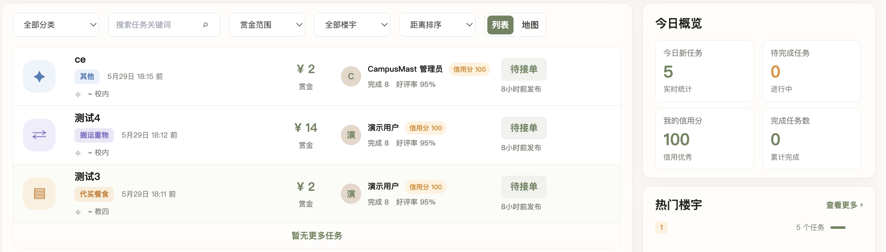
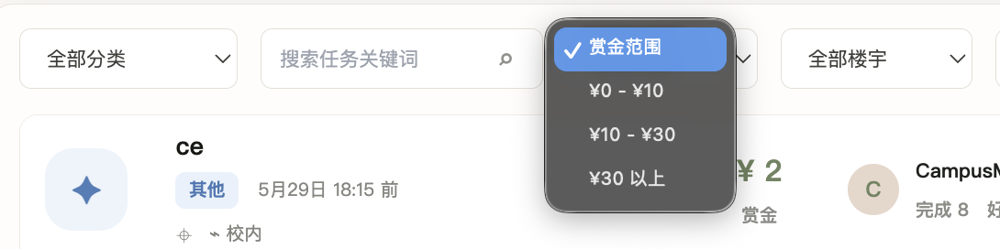

p0:高优先级 p1:中优先级 p2:低优先级
**5-24**
- [ ] [p1]1.首页有重影。
- [ ] [p0]2.顶部导航栏‘任务大厅’的样式与众不同，而且点击后没有反应，貌似是因为同时将该页面命名成了‘首页’和‘任务大厅’。
- [ ] [p0]3.可以看到，明明发布了5个任务，但是只显示了3个，其他的只能通过搜索看到，像是任务列表被人为限制到3条。
- [ ] [p1]4.选择结束后会有黑框。
- [ ] [p1]5.选项栏太丑了。
- [ ] [p1]6.图标和符号不统一，页面混用了 emoji、特殊字符、手写 SVG、文字符号：👋、＋、⌖、⌁、▣、▤ 等。观感上不够专业，也会带来字体兼容差异。如图。
可以使用同一的图标库。
- [ ] [p1]7.色彩过于保守且单调，主色几乎一直是灰绿 + 米白，缺少能承载“校园互助、任务效率、状态变化”的清晰系统色。现在页面读起来偏“温和后台模板”，但 CampusMast 的核心是任务流转和即时行动，应该更强调状态、距离、赏金、紧急程度。
- [ ] [p0]8.代码层面发现布局是硬编码出来的，响应式风险很高，这完全抛弃了vue的优势，容易出现适配问题。
- [ ] [p0]9.完全没有动态效果、交互反馈和过渡动画，页面感觉很僵硬，可以在github上找一下动态效果的ui库。
- [ ] [p2]10.字体过于单一，缺乏层次感和视觉引导。

---
gpt对于UI的设计和审美能力取决于提示词水平和人的想象力，如果一定要使用gpt进行UI设计，请务必提供足够详细的设计需求和参考资料。而使用claude opus进行UI设计，不用字斟句酌，直接让它发挥想象力即可。使用claude的途径主要有中转站和windsurf pro体验账号。**建议花3.88在咸鱼买一个体验账号使用opus模型进行UI设计**，省时省力。