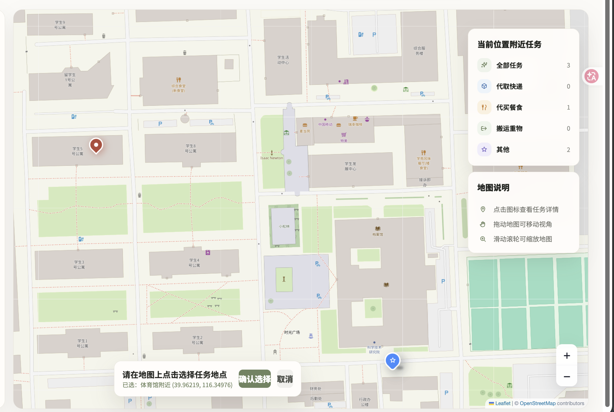
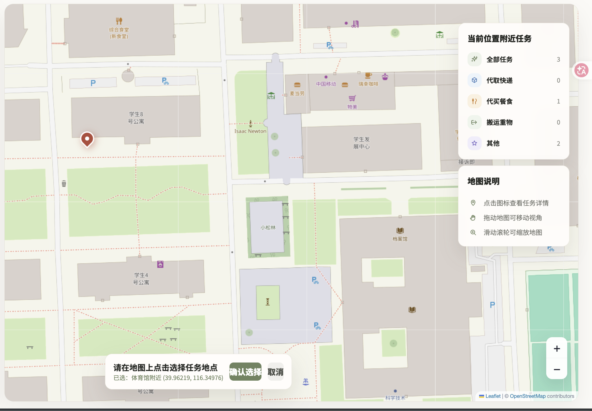
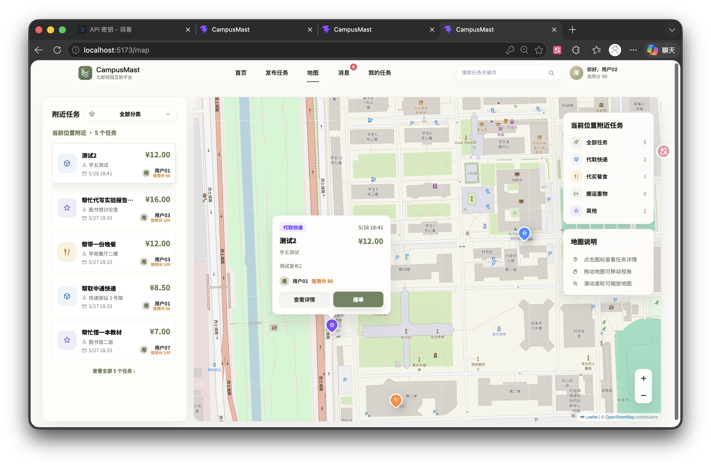
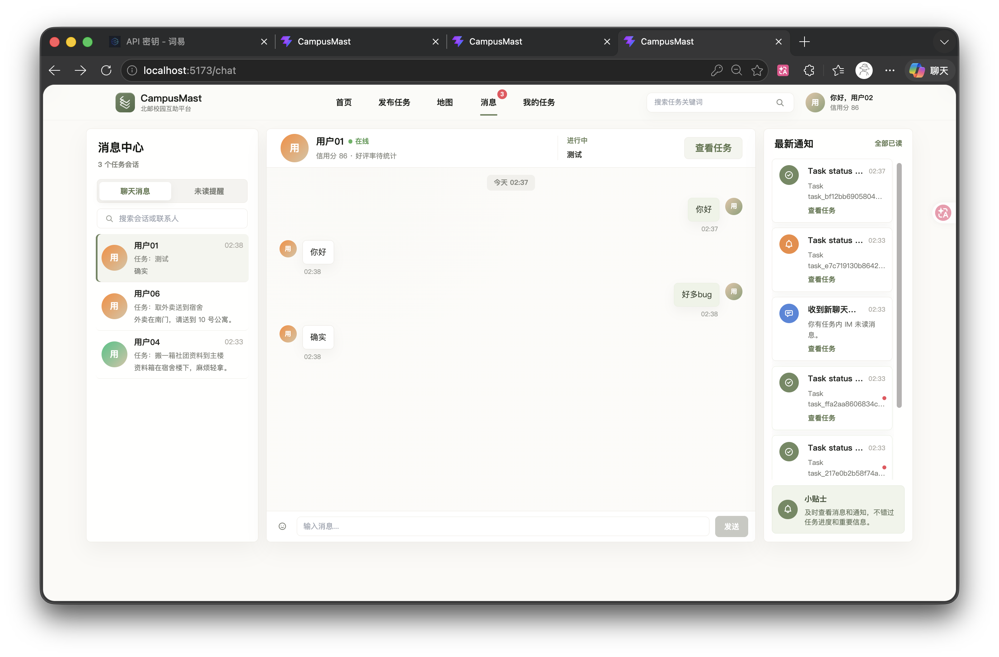

p0:高优先级 p1:中优先级 p2:低优先级
**5-24**
- [x] [p0]1.新增了 `Task.latitude` / `Task.longitude` 字段，但没有提供对应 Alembic 数据库迁移。现有数据库的 `tasks` 表缺少这两列时，后端查询任务会直接 500，已观察到 `/api/tasks/my/posted?page=1&limit=1&status=COMPLETED` 报 `500 Internal Server Error`，首页因此显示“任务加载失败”。涉及代码：`backend/app/models/task.py`、`backend/app/services/task_service.py`，但 `backend/alembic/versions` 中没有新增迁移文件。
- [x] [p0]2.首页统计接口依赖多个任务接口并发请求，其中一个任务接口 500 会导致首页整体加载失败。当前 `frontend/src/pages/TaskHallPage.vue` 的 `fetchHomepageStats()` 会调用“我发布的任务”等接口，后端异常没有被降级处理，导致一个后端字段/迁移问题直接暴露为首页不可用。
- [x] [p1]3.本轮提交名义上是“优化首页任务大厅视觉与筛选体验”，但实际改动包含后端模型、服务、启动数据、对象存储配置等内容，范围过大。UI 修复 PR 中混入数据库结构变更，会提高审查难度，也容易遗漏迁移、兼容性和回归测试。
- [x] [p1]4.`backend/app/bootstrap.py` 中出现了疑似误粘贴的本地 SQLite 配置代码：`database_url: str = "sqlite:///./campusmast.db"`。该变量写在 `_ensure_homepage_blocks()` 逻辑里，没有实际作用，容易误导后续维护者，以为这里控制开发数据库配置。
- [x] [p1]5.初始化演示任务的数据状态不一致：任务状态是 `PENDING`，但同时写入了 `helper_id`、`proof_note`、`needs_admin_review=True` 等更像“已接单/已提交证明/等待审核”的字段。该类数据会影响首页统计、任务筛选和测试判断，建议按真实业务流转重新设置。
- [x] [p1]6.本轮至少需要补充后端回归验证：`GET /api/tasks`、`GET /api/tasks/my/posted?status=COMPLETED`、`GET /api/tasks/my/accepted?status=IN_PROGRESS`，并在已有数据库上执行 `alembic upgrade head` 后再测试。不能只通过新库或前端静态页面判断通过。

**5-26**
- [x] [p0]7.楼宇定位不对，地图选点学5，却显示在体育馆附近。
- [x] [p0]8.同一个点，将地图缩放后，发生了漂移，点位偏到学8附近了，但是经纬度没有变化。
- [x] [p0]9.地图选完点发布后，其他人看点位发生了偏移（同问题1的点位，我选在学5，但是发布后显示在别的地方，而且偏移较远）
- [x] [p1]10.用户消息界面，右侧显示的Task status都是些什么，为什么会是英文的，这样谁看的懂。

- [x] [p0]11.距离排序的依据是什么，目前没有看到有关距离的显示，既然有距离排序，就要获取用户当前定位，这个定位如何获取？是真实定位还是用户选点？演示环境下建议用户选点。
- [x] [p1]12.与问题11相关，当前用户位置需要显示在地图上。
- [x] [p0]13.推荐算法在哪里体现？并没有找到与推荐算法相关的元素。
- [x] [p0]14.AI审核流程应该按照以下规则：
    - 任务发布后，先判断是否命中敏感词，如果命中，则直接不予发布。如果未命中敏感词再由 AI 进行初步审核，判断是否存在违规内容。如果 AI 返回'accept'，则直接发布；如果 AI 返回'reject'，则不予发布；如果 AI 返回‘refuse’，同时携带风险提示（低，中，高），则先允许发布，但是进入人工复审队列。
    - 人工审核时，管理员可以查看 AI 的审核结果和理由，并结合自己的判断进行审核。管理员可以选择通过审核或者下架。
    - 所有的审核结果和操作都应该有记录，并且用户可以查看自己的发布内容的审核记录，包括 AI 审核和人工审核的结果和理由。
---
