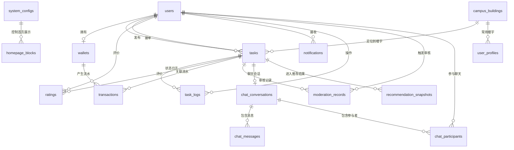

# CampusMast 数据库设计

> 版本：v2.0
> 更新日期：2026-04-14
> 数据库：MySQL 8.0 + Redis
> 状态：冻结版本

---

## 1. 设计目标

本设计用于支撑以下冻结能力：

- 任务状态机与资金事务
- 双分制加权信用体系
- WebSocket 通知与任务内 IM
- 北邮校园地图楼宇点位
- DeepSeek AI 审核
- 智能任务推荐
- 完整运营后台与首页内容配置

---

## 2. 存储划分

### 2.1 MySQL 持久化数据

- 用户、钱包、任务、流水、评价、任务日志
- 站内通知、聊天会话、聊天消息
- 校园楼宇点位
- AI 审核记录
- 系统配置、首页内容配置
- 推荐快照与统计

### 2.2 Redis 缓存/实时数据

- WebSocket 在线连接映射
- 通知未读计数
- IM 未读计数
- 聊天实时广播
- 推荐缓存

---

## 3. ER 关系图



---

## 4. 核心表设计

### 4.1 users

| 字段 | 类型 | 说明 |
|------|------|------|
| id | varchar(25) PK | 用户 ID |
| student_email | varchar(100) UK | 校园邮箱 |
| password_hash | varchar(255) | 密码哈希 |
| nickname | varchar(50) | 昵称 |
| avatar_url | varchar(500) | 头像 |
| phone | varchar(20) | 手机号 |
| role | enum | `USER` / `ADMIN` |
| requester_credit_score | decimal(5,2) | 需求方信用分 |
| helper_credit_score | decimal(5,2) | 接单方信用分 |
| overall_credit_score | decimal(5,2) | 综合展示分 |
| is_active | boolean | 是否启用 |
| created_at | datetime | 创建时间 |
| updated_at | datetime | 更新时间 |

### 4.2 user_profiles

| 字段 | 类型 | 说明 |
|------|------|------|
| user_id | varchar(25) PK/FK | 用户 ID |
| default_building_code | varchar(32) FK | 常用楼宇编码 |
| preferred_categories | json | 偏好任务分类 |
| active_time_slots | json | 活跃时段统计 |
| helper_success_rate | decimal(5,2) | 历史完成成功率快照 |
| updated_at | datetime | 更新时间 |

### 4.3 wallets

| 字段 | 类型 | 说明 |
|------|------|------|
| id | varchar(25) PK | 钱包 ID |
| user_id | varchar(25) FK/UK | 用户 ID |
| available | decimal(10,2) | 可用余额 |
| frozen | decimal(10,2) | 冻结余额 |
| updated_at | datetime | 更新时间 |

### 4.4 transactions

| 字段 | 类型 | 说明 |
|------|------|------|
| id | varchar(25) PK | 流水 ID |
| wallet_id | varchar(25) FK | 钱包 ID |
| type | enum | `TOP_UP` / `WITHDRAW` / `FREEZE` / `UNFREEZE` / `SETTLE_OUT` / `SETTLE_IN` / `SETTLE_SPLIT` |
| amount | decimal(10,2) | 金额 |
| balance_after | decimal(10,2) | 余额快照 |
| related_task_id | varchar(25) FK | 关联任务 |
| description | varchar(200) | 描述 |
| created_at | datetime | 创建时间 |

### 4.5 campus_buildings

| 字段 | 类型 | 说明 |
|------|------|------|
| code | varchar(32) PK | 楼宇编码 |
| name | varchar(100) | 楼宇名称 |
| campus_zone | varchar(50) | 校区分区 |
| x_coord | decimal(10,4) | 平面图 X 坐标 |
| y_coord | decimal(10,4) | 平面图 Y 坐标 |
| is_active | boolean | 是否启用 |
| created_at | datetime | 创建时间 |
| updated_at | datetime | 更新时间 |

### 4.6 tasks

| 字段 | 类型 | 说明 |
|------|------|------|
| id | varchar(25) PK | 任务 ID |
| title | varchar(100) | 标题 |
| description | text | 描述 |
| category | enum | `package` / `food` / `move` / `other` |
| reward | decimal(10,2) | 报酬 |
| status | enum | `PENDING` / `IN_PROGRESS` / `PENDING_REVIEW` / `COMPLETED` / `DISPUTED` / `CANCELLED` / `EXPIRED` / `CLOSED_BY_ADMIN` |
| building_code | varchar(32) FK | 楼宇编码 |
| location_detail | varchar(200) | 详细地点 |
| deadline | datetime | 截止时间 |
| image_urls | json | 图片列表 |
| requester_id | varchar(25) FK | 需求方 |
| helper_id | varchar(25) FK | 接单方 |
| proof_note | text | 完成说明 |
| proof_image_urls | json | 完成图片 |
| moderation_result | enum | `ALLOW` / `REVIEW` / `BLOCK` |
| needs_admin_review | boolean | 是否待复审 |
| version | int | 乐观锁版本号 |
| created_at | datetime | 创建时间 |
| updated_at | datetime | 更新时间 |
| completed_at | datetime | 完成时间 |

### 4.7 task_logs

| 字段 | 类型 | 说明 |
|------|------|------|
| id | varchar(25) PK | 日志 ID |
| task_id | varchar(25) FK | 任务 ID |
| from_status | enum | 原状态 |
| to_status | enum | 新状态 |
| actor_id | varchar(25) FK | 操作人 |
| remark | varchar(500) | 备注 |
| created_at | datetime | 创建时间 |

### 4.8 ratings

| 字段 | 类型 | 说明 |
|------|------|------|
| id | varchar(25) PK | 评价 ID |
| task_id | varchar(25) FK | 任务 ID |
| from_user_id | varchar(25) FK | 评价人 |
| to_user_id | varchar(25) FK | 被评价人 |
| score | int | 1-5 分 |
| comment | text | 评论 |
| created_at | datetime | 创建时间 |

### 4.9 credit_snapshots

| 字段 | 类型 | 说明 |
|------|------|------|
| id | varchar(25) PK | 快照 ID |
| user_id | varchar(25) FK | 用户 ID |
| role_scope | enum | `REQUESTER` / `HELPER` |
| completion_rate | decimal(5,2) | 完成率 |
| average_rating | decimal(5,2) | 平均评分 |
| timeout_rate | decimal(5,2) | 超时率 |
| abandon_rate | decimal(5,2) | 放弃率 |
| dispute_lose_rate | decimal(5,2) | 争议败诉率 |
| malicious_dispute_rate | decimal(5,2) | 恶意争议率 |
| post_accept_cancel_rate | decimal(5,2) | 接单后取消率 |
| calculated_score | decimal(5,2) | 计算后得分 |
| calculated_at | datetime | 计算时间 |

### 4.10 notifications

| 字段 | 类型 | 说明 |
|------|------|------|
| id | varchar(25) PK | 通知 ID |
| user_id | varchar(25) FK | 接收用户 |
| type | varchar(50) | 事件类型 |
| title | varchar(100) | 标题 |
| body | text | 内容 |
| related_task_id | varchar(25) FK | 关联任务 |
| is_read | boolean | 是否已读 |
| created_at | datetime | 创建时间 |

### 4.11 chat_conversations

| 字段 | 类型 | 说明 |
|------|------|------|
| id | varchar(25) PK | 会话 ID |
| task_id | varchar(25) FK/UK | 任务 ID |
| status | enum | `ACTIVE` / `CLOSED` |
| created_at | datetime | 创建时间 |
| updated_at | datetime | 更新时间 |

### 4.12 chat_participants

| 字段 | 类型 | 说明 |
|------|------|------|
| id | varchar(25) PK | 参与记录 ID |
| conversation_id | varchar(25) FK | 会话 ID |
| user_id | varchar(25) FK | 用户 ID |
| unread_count | int | 未读数 |
| last_read_message_id | varchar(25) | 最后已读消息 |
| joined_at | datetime | 加入时间 |

### 4.13 chat_messages

| 字段 | 类型 | 说明 |
|------|------|------|
| id | varchar(25) PK | 消息 ID |
| conversation_id | varchar(25) FK | 会话 ID |
| sender_id | varchar(25) FK | 发送者 |
| message_type | enum | `TEXT` |
| content | text | 文本内容 |
| client_message_id | varchar(64) | 前端幂等 ID |
| created_at | datetime | 创建时间 |

### 4.14 moderation_records

| 字段 | 类型 | 说明 |
|------|------|------|
| id | varchar(25) PK | 审核记录 ID |
| task_id | varchar(25) FK | 任务 ID |
| user_id | varchar(25) FK | 提交用户 |
| provider | varchar(50) | 默认 `DEEPSEEK` |
| risk_level | enum | `ALLOW` / `REVIEW` / `BLOCK` |
| hit_tags | json | 命中标签 |
| model_output | json | 原始审核结果 |
| admin_review_status | enum | `PENDING` / `APPROVED` / `REJECTED` |
| admin_review_note | varchar(500) | 复审说明 |
| created_at | datetime | 创建时间 |
| reviewed_at | datetime | 复审时间 |

### 4.15 recommendation_snapshots

| 字段 | 类型 | 说明 |
|------|------|------|
| id | varchar(25) PK | 记录 ID |
| user_id | varchar(25) FK | 用户 ID |
| task_id | varchar(25) FK | 被推荐任务 |
| score_total | decimal(6,2) | 总分 |
| score_category | decimal(6,2) | 类别偏好得分 |
| score_distance | decimal(6,2) | 距离得分 |
| score_success_rate | decimal(6,2) | 历史成功率得分 |
| score_active_time | decimal(6,2) | 活跃时段得分 |
| snapshot_date | datetime | 生成时间 |

### 4.16 system_configs

| 字段 | 类型 | 说明 |
|------|------|------|
| config_key | varchar(100) PK | 配置键 |
| config_group | varchar(50) | 配置分组 |
| config_value | json | 配置值 |
| description | varchar(200) | 描述 |
| updated_by | varchar(25) FK | 更新人 |
| updated_at | datetime | 更新时间 |

### 4.17 homepage_blocks

| 字段 | 类型 | 说明 |
|------|------|------|
| id | varchar(25) PK | 模块 ID |
| block_type | enum | `ANNOUNCEMENT` / `BANNER` / `RECOMMEND_SLOT` |
| title | varchar(100) | 标题 |
| content | json | 内容 |
| sort_order | int | 排序 |
| is_active | boolean | 是否启用 |
| updated_by | varchar(25) FK | 更新人 |
| updated_at | datetime | 更新时间 |

---

## 5. 枚举定义

```python
class Role(str, enum.Enum):
    USER = "USER"
    ADMIN = "ADMIN"

class TaskStatus(str, enum.Enum):
    PENDING = "PENDING"
    IN_PROGRESS = "IN_PROGRESS"
    PENDING_REVIEW = "PENDING_REVIEW"
    COMPLETED = "COMPLETED"
    DISPUTED = "DISPUTED"
    CANCELLED = "CANCELLED"
    EXPIRED = "EXPIRED"
    CLOSED_BY_ADMIN = "CLOSED_BY_ADMIN"

class ModerationResult(str, enum.Enum):
    ALLOW = "ALLOW"
    REVIEW = "REVIEW"
    BLOCK = "BLOCK"

class AdminReviewStatus(str, enum.Enum):
    PENDING = "PENDING"
    APPROVED = "APPROVED"
    REJECTED = "REJECTED"

class ChatMessageType(str, enum.Enum):
    TEXT = "TEXT"

class HomepageBlockType(str, enum.Enum):
    ANNOUNCEMENT = "ANNOUNCEMENT"
    BANNER = "BANNER"
    RECOMMEND_SLOT = "RECOMMEND_SLOT"
```

---

## 6. 索引策略

| 表 | 索引 | 用途 |
|---|---|---|
| users | `student_email` (UK) | 登录 |
| tasks | `(status, created_at)` | 任务大厅 |
| tasks | `(building_code, status)` | 地图与附近任务 |
| tasks | `requester_id` / `helper_id` | 我的任务 |
| tasks | `needs_admin_review` | 审核后台 |
| transactions | `(wallet_id, created_at)` | 钱包流水 |
| task_logs | `(task_id, created_at)` | 状态时间线 |
| ratings | `(task_id, from_user_id)` (UK) | 防重复评价 |
| notifications | `(user_id, is_read, created_at)` | 通知列表与未读 |
| chat_messages | `(conversation_id, created_at)` | 聊天记录 |
| chat_participants | `(user_id, conversation_id)` | 用户会话查询 |
| moderation_records | `(risk_level, admin_review_status, created_at)` | 审核后台 |
| recommendation_snapshots | `(user_id, snapshot_date)` | 推荐结果查询 |

---

## 7. 一致性约束

### 7.1 事务约束

- 发布任务 = 审核通过/低危 + 创建任务 + 冻结资金 + 写任务日志
- 接单 = 锁任务 + 改状态 + 建聊天会话 + 发通知
- 完成 = 改状态 + 结算资金 + 允许评价 + 发通知
- 争议裁决 = 改状态 + 资金处理 + 信用调整 + 发通知

### 7.2 并发约束

- 任务接单必须使用行锁或等价并发控制
- 聊天消息写入使用 `client_message_id` 防重
- 信用分计算使用快照方式，避免覆盖竞争

### 7.3 配置约束

- 信用权重、推荐权重、审核阈值、接单门槛必须来自 `system_configs`
- 首页内容必须来自 `homepage_blocks`
- 校园楼宇点位必须来自 `campus_buildings`

---

## 8. SQLAlchemy 建模建议

建议按以下模块拆分模型文件：

- `user.py`：`User`、`UserProfile`
- `wallet.py`：`Wallet`、`Transaction`
- `task.py`：`Task`、`TaskLog`
- `rating.py`：`Rating`、`CreditSnapshot`
- `notification.py`：`Notification`
- `chat.py`：`ChatConversation`、`ChatParticipant`、`ChatMessage`
- `map.py`：`CampusBuilding`
- `moderation.py`：`ModerationRecord`
- `recommendation.py`：`RecommendationSnapshot`
- `config.py`：`SystemConfig`、`HomepageBlock`

---

## 9. Redis Key 设计建议

| Key 模式 | 用途 |
|------|------|
| `ws:user:{userId}` | 用户在线连接 |
| `notify:unread:{userId}` | 通知未读数 |
| `chat:unread:{userId}:{conversationId}` | 聊天未读数 |
| `chat:channel:{taskId}` | 任务聊天广播 |
| `recommend:user:{userId}` | 推荐缓存 |

---

## 10. 验收检查点

- 数据模型覆盖四个必做模块与四个进阶模块
- 用户表包含双信用分字段
- 地图、审核、IM、推荐、系统配置、首页配置均有独立数据模型
- 钱包事务与任务状态机可在同一事务中联动
